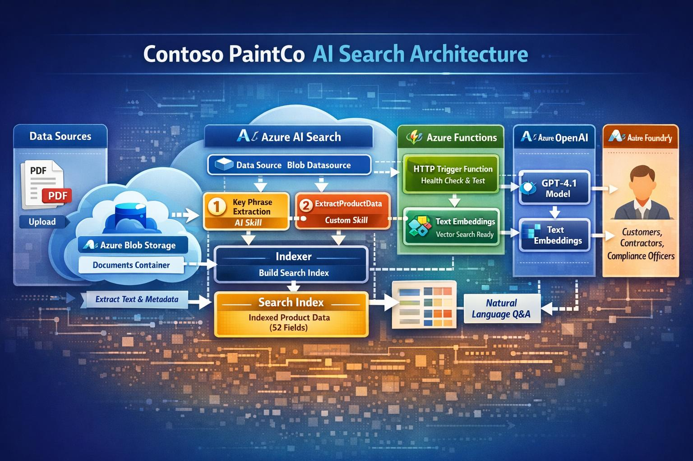
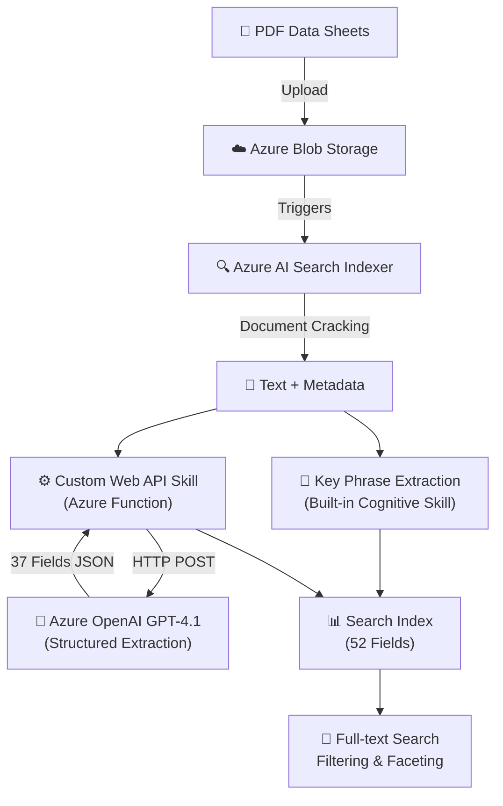

# Contoso PaintCo AI Search "Build an AI-Powered Product Search Agent with Azure AI — From Zero to RAG in 6 Videos"


An end-to-end **AI-powered document intelligence pipeline** that automatically extracts structured product data from unstructured PDF technical data sheets using Azure AI Search, Azure Functions, and Azure OpenAI (GPT-4.1).
Learn how to build a complete Retrieval-Augmented Generation (RAG) agent using Azure AI services. We take 10 paint product PDF data sheets, upload them to Azure, extract structured data with GPT-4.1, index everything in Azure AI Search, and connect it to a chat agent — all in under 60 minutes of video.
Technologies: Azure Functions (.NET 8), Azure Blob Storage, Azure OpenAI (GPT-4.1), Azure AI Search, Azure AI Foundry



## Skills Demonstrated

- **Azure AI Search** — indexers, skillsets, custom skills, field mappings, index schema design
- **Azure OpenAI** — prompt engineering for structured data extraction, GPT-4.1 integration
- **Azure Functions** — .NET 8 isolated worker, Flex Consumption plan, HTTP triggers, custom skill contract
- **Document Intelligence** — PDF text extraction, unstructured-to-structured data transformation
- **Cloud Architecture** — serverless design, event-driven pipelines, Azure service integration
- **C# / .NET 8** — async/await, HTTP clients, JSON serialization, dependency injection

## The Problem

Paint manufacturers produce hundreds of product technical data sheets (TDS) as PDFs. These documents contain critical information — SKUs, VOC values, coverage rates, dry times, safety data — buried in unstructured text. Manually extracting this data for searchable catalogs is slow, error-prone, and doesn't scale.

## The Solution

This project builds an **automated AI enrichment pipeline** that:

1. **Ingests** PDF data sheets from Azure Blob Storage
2. **Extracts text** and metadata via Azure AI Search's built-in document cracking
3. **Enriches** documents using a two-stage AI skillset:
   - **Key Phrase Extraction** — identifies important terms using a built-in cognitive skill
   - **Custom Web API Skill** — calls an Azure Function that uses GPT-4.1 to extract **37 structured fields** from raw PDF text
4. **Indexes** all extracted fields into a rich, searchable index with filtering, faceting, and sorting

The result is a fully searchable product catalog where users can query by finish type, filter by VOC compliance, sort by coverage, and find products using natural language — all sourced automatically from raw PDFs.

## Sample Output

A raw PDF like `Contoso_PaintCo_Product_01_CTSO-PAINT-EXT-SAT-1G-DB.pdf` containing pages of unstructured text is automatically transformed into structured data:

```json
{
  "sku": "CTSO-PAINT-EXT-SAT-1G-DB",
  "upc": "012345678901",
  "productName": "Contoso WeatherShield Exterior Satin",
  "brand": "Contoso PaintCo",
  "finish": "Exterior",
  "sheen": "Satin",
  "base": "Deep Base",
  "color": "Deep Base (tintable)",
  "intendedUse": "Exterior wood, siding, trim, and masonry surfaces",
  "vocValue": 48.0,
  "vocUnit": "g/L",
  "coverageMin": 350,
  "coverageMax": 400,
  "coverageUnit": "sq ft/gal",
  "dryTimeTouchMinutes": 60,
  "dryTimeRecoatMinutes": 240,
  "dryTimeCureDays": 30,
  "recommendedCoats": 2,
  "cleanup": "Soap and water",
  "warrantyYears": 25,
  "warrantyType": "Limited Lifetime",
  "resinType": "100% Acrylic Latex",
  "productSummary": "Premium exterior satin paint with advanced UV and moisture resistance...",
  "applicationPrep": "Clean surface of all dirt, mildew, and loose paint. Prime bare wood...",
  "safetyHandling": "Use in well-ventilated areas. Avoid eye and skin contact...",
  "disclaimer": "Colors may vary from samples. Test in an inconspicuous area first..."
}
```

Every field becomes **searchable, filterable, and facetable** in the Azure AI Search index — enabling queries like *"show me all exterior paints with VOC under 50 g/L and at least 25-year warranty"*.

## Business Impact

| Manual Process | With This Pipeline |
|---|---|
| Hours per PDF to manually read and transcribe data | **Seconds** — fully automated extraction |
| Error-prone copy/paste into spreadsheets | **Consistent, structured JSON** from GPT-4.1 |
| No search capability across products | **Full-text search** with filtering and faceting |
| Compliance checks require reading each TDS | **Instant VOC/safety filtering** across all products |
| Scaling requires more headcount | **Serverless** — scales to zero, handles any volume |

Downstream use cases enabled: RAG-based product Q&A, contractor self-service lookup, regulatory compliance filtering, automated product comparison, and catalog generation.

## Architecture

| Component | Service | Purpose |
|---|---|---|
| **Document Storage** | Azure Blob Storage | Stores product PDF data sheets |
| **Search & Orchestration** | Azure AI Search | Indexer pipeline, skillsets, and search index |
| **AI Enrichment** | Azure Functions (.NET 8, Flex Consumption) | Custom Web API skill for structured extraction |
| **Language Model** | Azure OpenAI (GPT-4.1) | Extracts 37 product fields from unstructured text |
| **AI Platform** | Azure AI Foundry | Model management and deployment |

## Extracted Fields

The custom skill extracts a comprehensive set of product attributes from each PDF:

| Category | Fields |
|---|---|
| **Identity** | SKU, UPC, Product Name, Brand |
| **Product Characteristics** | Finish, Sheen, Base, Color, Intended Use, Resin Type |
| **Performance** | Coverage (min/max), Recommended Coats, VOC Value/Unit |
| **Dry Times** | Touch Dry (minutes), Recoat (minutes), Full Cure (days) |
| **Technical Specs** | Solids by Volume/Weight, Viscosity (min/max/unit), DFT, WFT, Film Thickness Unit |
| **Storage** | Min/Max Storage Temp (°F), Shelf Life (months) |
| **Warranty** | Warranty Years, Warranty Type |
| **Descriptive** | Product Summary, Application Prep, Safety/Handling, Disclaimer, Cleanup |

## Project Structure

```
├── Architecture/                    # Architecture diagram
├── Data/files/                      # Sample product PDF data sheets (10 products)
├── index-files/                     # Azure AI Search resource definitions
│   ├── datasource.json              # Blob storage data source configuration
│   ├── index.json                   # Search index schema (52 fields)
│   ├── skillset.json                # Base skillset definition
│   ├── skillset-extraction.json     # Enhanced skillset with custom AI extraction
│   ├── indexer.json                 # Standard indexer
│   └── indexer-with-extraction.json # Indexer with output field mappings for all 37 extracted fields
├── ProductExtractionFunction/       # Azure Function (.NET 8 Isolated Worker)
│   ├── ParseProductJson.cs          # Core function — OpenAI integration + field extraction
│   ├── Program.cs                   # Function app host configuration
│   └── host.json                    # Function runtime settings
└── contoso-ai-paints.sln            # Solution file
```

## How It Works



## Key Technical Decisions

- **Azure Functions Flex Consumption** — auto-scales to zero, pay-per-execution, ideal for batch indexing workloads
- **.NET 8 Isolated Worker** — modern hosting model with full dependency injection support
- **GPT-4.1 with temperature 0.0** — deterministic extraction for consistent structured output
- **Batch size 1, degree of parallelism 1** — deliberate throttling to respect OpenAI rate limits during indexing
- **Custom Web API Skill pattern** — follows the Azure AI Search custom skill interface contract (`values[]` request/response format)
- **Environment variables for secrets** — API keys loaded from app settings, not hardcoded

## Getting Started

### Prerequisites

- Azure Subscription with:
  - Azure AI Search service
  - Azure Blob Storage account
  - Azure OpenAI resource with a GPT-4.1 deployment
  - Azure Function App (.NET 8, Flex Consumption)
- [.NET 8 SDK](https://dotnet.microsoft.com/download/dotnet/8.0)
- [Azure Functions Core Tools v4](https://learn.microsoft.com/azure/azure-functions/functions-run-local)

### Setup

1. **Deploy the Azure Function:**
   ```bash
   cd ProductExtractionFunction
   func azure functionapp publish <YOUR_FUNCTION_APP_NAME>
   ```

2. **Configure environment variables** on your Function App:
   | Setting | Value |
   |---|---|
   | `AZURE_OPENAI_ENDPOINT` | Your Azure OpenAI endpoint URL |
   | `AZURE_OPENAI_DEPLOYMENT` | Your GPT model deployment name |
   | `AZURE_OPENAI_API_KEY` | Your Azure OpenAI API key |

3. **Upload PDFs** to your Blob Storage `documents` container

4. **Create Azure AI Search resources** using the JSON definitions in `index-files/`:
   - Create the data source (`datasource.json`) — update the connection string
   - Create the index (`index.json`)
   - Create the skillset (`skillset-extraction.json`) — update the function URL
   - Create the indexer (`indexer-with-extraction.json`)

5. **Run the indexer** — documents will be processed automatically


## License

This is a personal portfolio project by [Dhaval Shah](https://github.com/dhavalshah01).
